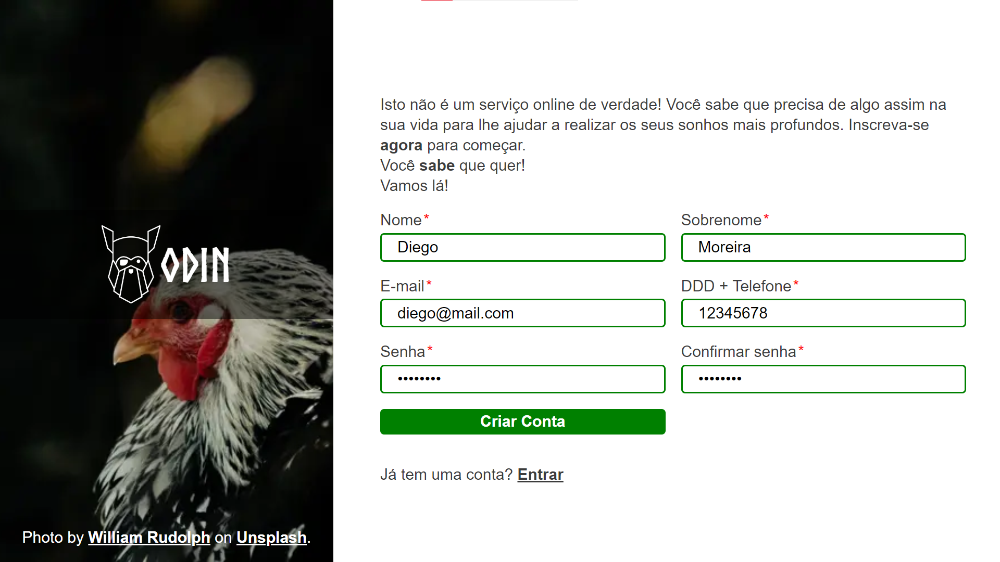

# Formulário básico

Este é um projeto de formulário feito com HTML, Sass e um pouquinho de JavaScript. O projeto foi proposto pelo site [The Odin Project](https://www.theodinproject.com) para fixação do aprendizado de formulários HTML. O projeto pode ser acessado no link [diego-moreira8.github.io/odin-sign-up-form](https://diego-moreira8.github.io/odin-sign-up-form).

